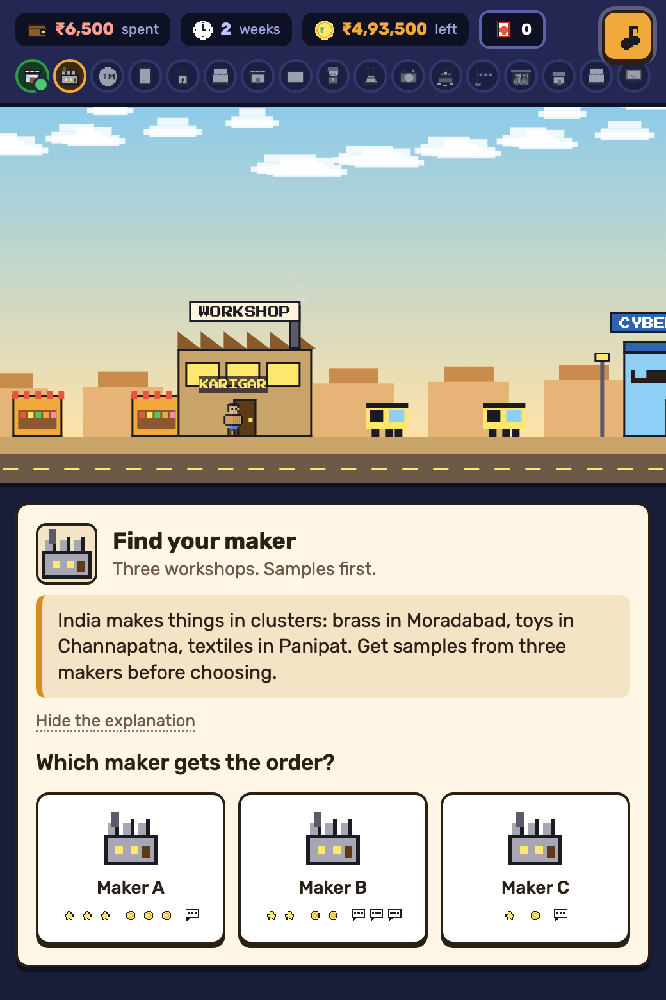

# amyra-ind-usa-export

**The Journey of One Box** is a pixel-art browser game that shows anyone in India how to export a product and sell it on Amazon USA, in plain words.

### ▶ Play it live: [games.edock.io/amyra-ind-usa-export](https://games.edock.io/amyra-ind-usa-export)

Free to play on any phone or computer. No sign-up, no download.

<p align="center"></p>

## What the game is about

You carry one branded box from a workshop in India to a customer's doorstep in America, then bring the money home. On the way you collect the paperwork an exporter really needs. Every official term arrives as a stamp in your passport, with a one-line meaning, so the jargon comes after the idea.

| # | Stop | What you do there | Stamps you earn |
|---|------|-------------------|-----------------|
| 1 | Bazaar | Pick a product: copper bottle, spice blend, wooden toy or cotton throw | |
| 2 | Workshop | Choose a maker and get the design in writing | Golden sample, Design paper |
| 3 | Cyber Café | Name your brand and file a US trademark | Trademark |
| 4 | DGFT | Get India's exporter ID | IEC |
| 5 | GST Office | Register for GST and sign the promise letter that skips upfront tax | GST number, LUT |
| 6 | Bank | Use a business account and register the bank's code with customs | AD Code |
| 7 | Seller Central | Open Amazon USA, get a US tax number, declare you live outside the US | Seller account, EIN, W-8BEN |
| 8 | Factory | Make 300 units with the brand printed on, inspect, photograph | First batch |
| 9 | Brand Registry | Prove the brand is yours, buy genuine barcodes | Brand Registry, GS1 barcode |
| 10 | Rules Lab | Pass US product rules, which differ by product | FDA, CPC or US label, Made in India |
| 11 | Photo Studio | Pick the main photo and the words Americans search for | Listing live |
| 12 | Port | Ship or fly, and choose who answers to US customs | Importer of Record, Shipping bill |
| 13 | US Customs | Pay import duty | |
| 14 | FBA Warehouse | Check stock in, run ads, get honest first reviews | In FBA, Launched |
| 15 | Customer | Deliver the box | |
| 16 | Your Bank | Collect the receipt proving the dollars arrived | FIRA |
| 17 | DGFT Portal | Match receipt and shipping bill to close the promise | e-BRC |

## How to play

- **Walk** by holding the right side of the picture or tapping Walk. On a keyboard, use the arrow keys and Enter.
- **Pick** at each stop by tapping a picture. A wrong pick shows what would really go wrong, costs time or money, and lets you try again.
- **Change** undoes any pick before you move on, with the money and weeks refunded.
- **Track** your progress in the top bar: money spent, weeks passed, money left, and a checklist of all 17 stops.
- **Finish** to see where every dollar of a sale goes, shown in dollars and rupees, and whether your first batch paid for itself.

Music and sound are generated in the browser. The speaker button at the top-right mutes them. Progress saves in the browser, so players can come back and continue.

A longer written version of the same journey lives at [games.edock.io/amyra-ind-usa-export/guide](https://games.edock.io/amyra-ind-usa-export/guide/).

## Run it on your computer

There is nothing to install. Open `index.html` in a browser, or serve the folder:

```bash
python3 -m http.server 8000
```

Then visit http://localhost:8000.

## Project layout

```
index.html          the game, ready to host (built from src/)
artifact.html       the same page without the <!doctype> wrapper, for hosts that add their own
guide/index.html    the written guide (built from src/guide.html)
build.sh            rebuilds the three files above from src/
src/
  content.js        products, stamps and all 17 stops: the file most changes touch
  game.js           game state, cards, checklist, passport, end screen, input
  world.js          regions, buildings, props and scenery
  art.js            pixel sprites and icons, all drawn in code
  audio.js          generative chiptune music and sound effects (Web Audio)
  head.html         title, fonts and styles
  body.html         page skeleton
  guide.html        the written guide
docs/screenshot.png
```

The whole game is one static HTML page with no dependencies and no build tools beyond `sh`. There are no image or audio files. Every sprite is drawn in code and every sound is synthesized, so the page works anywhere that can serve a file.

## Changing the game

Most changes happen in `src/content.js`:

- **`PRODUCTS`** sets each product's price in dollars, factory cost in rupees, Amazon warehouse fee, US duty rate and search words.
- **`STAMPS`** holds each official term with its one-line meaning.
- **`STATIONS`** holds the 17 stops. Each stop has a plain-words explanation and a list of steps. Each step offers choices, and each choice can cost rupees, add weeks, earn a stamp, or be wrong with a reason.
- **`FX`** is the dollar-to-rupee rate used everywhere, currently 84.
- **`SESSION`** is the live Edock session promoted at the end of the game: title, date, host, price, link and end time. Once the end time passes, the event card hides itself and the button points to all upcoming Edock sessions instead.

After any change in `src/`, rebuild and commit both the source and the built files:

```bash
./build.sh
```

## Links back to Edock

Players who finish the game see an invitation to Edock's next live session, currently [India to USA: Your first export on Amazon](https://edock.io/guest/community?event=india-to-usa-your-first-export-on-amazon&tab=events) on 2 October 2026.

Every link from the game to edock.io carries campaign tags, so Edock's Google Analytics credits the visit to this game:

| Tag | Value |
|-----|-------|
| `utm_source` | `amyra-ind-usa-export` |
| `utm_medium` | `game` |
| `utm_campaign` | the session, such as `india-to-usa-first-export-2oct` |
| `utm_content` | `end-results` for the results popup, `end-card` for the card that stays after it closes |
| `utm_term` | the product the player chose: `bottle`, `spice`, `toy` or `throw` |

The game itself has no analytics and sends nothing. The tags only travel when a player taps the link.

## Contributing

Any verified Edock user can make changes to this repository. Work lands on the `develop` branch, and the live game is published from `main`. Read [CONTRIBUTING.md](CONTRIBUTING.md) to request access and for the house rules: plain words first, pictures over text, rupees next to dollars, and an official source for every rule or fee.

Anyone else is welcome to open an issue, or to fork the project and make it their own.

## Use it, copy it, sell it

This project is released under the [MIT License](LICENSE). You may copy, change, rebrand, host and sell this game or anything you build from it, for free or for profit, without asking us. The one condition is to keep the copyright and license notice in your copy.

If you host your own copy, change `GUIDE_URL` in `src/game.js`, the address in `build.sh`, and `GAME_ID` and `SESSION` in `src/content.js` to your own.

## Hosting

Any static host works. Serve `index.html` at the root of the site and `guide/index.html` under `/guide/`.

This repository publishes itself with GitHub Pages through `.github/workflows/pages.yml`. Every change to `main` is published, and `main` only changes through a merged pull request.

To publish your own fork the same way, set **Settings → Pages → Source** to **GitHub Actions**, then add a repository variable named `DEPLOY_TO_GITHUB_PAGES` with the value `true`.

## Part of Edock Games

This is one of a series of free, open-source learning games from [Edock](https://edock.io). Each game lives in its own repository with this same layout and plays at `games.edock.io/<repository-name>`.

## Disclaimer

This is an educational game. The steps reflect Indian export and US import practice as of 2026, simplified for learning. Fees, duty rates and costs are round example figures at ₹84 per US dollar. Rules change often, so confirm current requirements with your bank, a chartered accountant and a freight forwarder before spending money. Nothing here is legal, tax or customs advice.

The game is not affiliated with or endorsed by Amazon or any government body. Amazon, Seller Central, Brand Registry, FBA and Vine are trademarks of Amazon.com, Inc. or its affiliates, named here only to explain how selling works.

## Credits

- Built by the Edock team.
- Fonts: [Press Start 2P](https://fonts.google.com/specimen/Press+Start+2P) and [Rubik](https://fonts.google.com/specimen/Rubik), both under the SIL Open Font License, loaded from Google Fonts.
